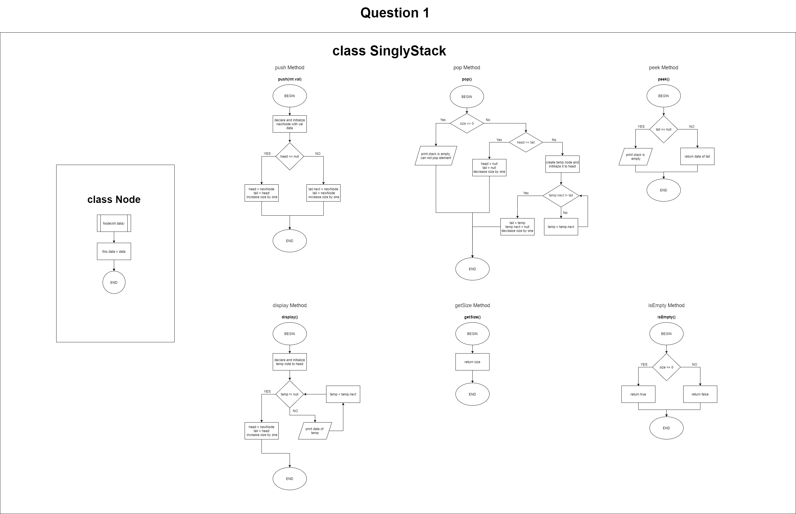
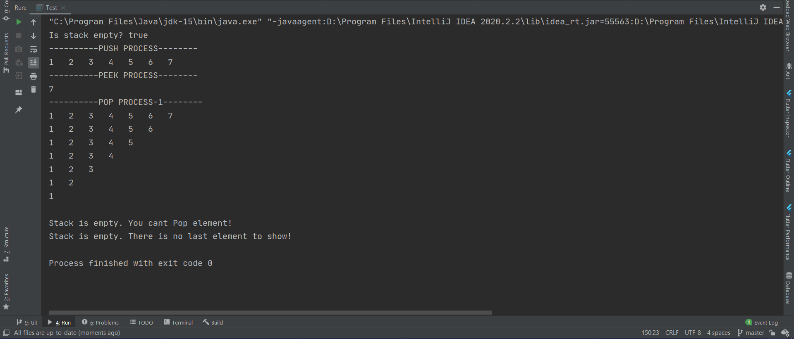
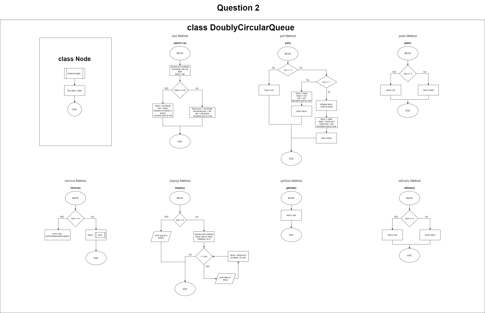
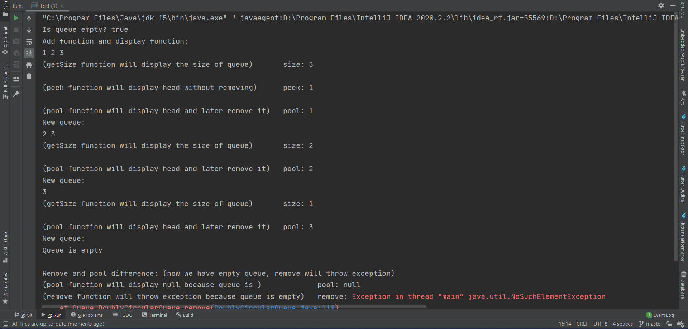
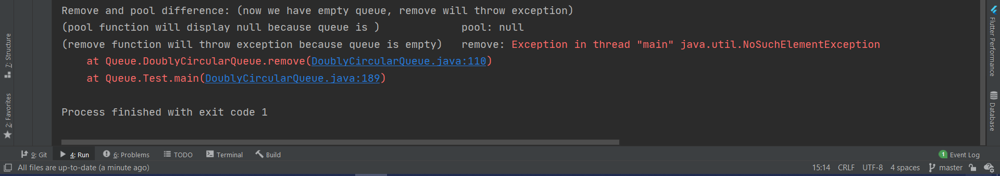
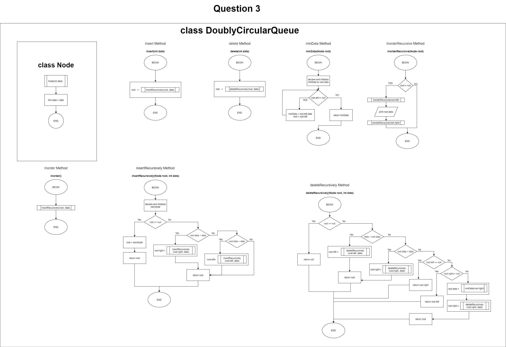
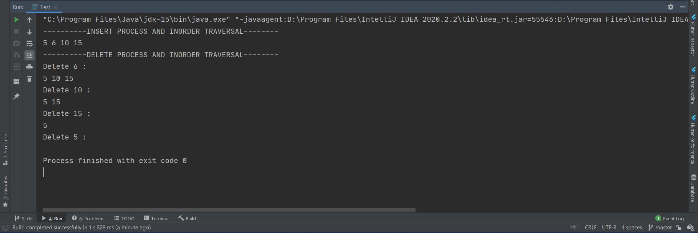

# Data structure workspace

### Overview
This repository contains my some of data structure implementations which I wrote for data structure lesson.

## Flowcharts and Outputs (also you can find the illustration of those structures from [illustrations](https://github.com/basarYargici/DataStructureFinal/blob/master/illustrationOfDataStructures.docx))
### Stack

* 
*  

### Queue

* 
*  
*  

### BinarySearchTree

* 
*  
